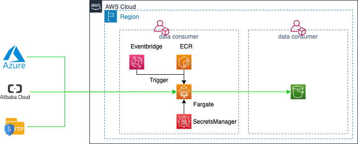

[toc]

# SFTP2S3 module introduction
This module will ingest the on-premises sftp data source into S3 bucket, and then process and catalog the data to  "Database".

## Which tools are involed
- Terraform
- rclone
- Amazon CloudWatch
- Amazon ECS
- Amazon Lambda
- Amazon Glue
- Amazon SecretsManager
- Python
- Docker
- awk
  
## Security
Your sensitive information will be saved into SecretsManager. 
- sftp password
- sftp private key
- access key
- access secret key

## Terraform module structure
- sftp2s3.tf, main module which integrates all block together.
- variables.tf, define the variables which you need to provide for this module.
- sftp2s3-Docker, which includes the ECR images defination.
- Doc, which includes the module configuration doc.
- conf, which includes the sftp2s3 configuration.
- code, which includes the lambda function code.

## How to use this module

### Prerequisite
Please add the following endpoints
- "cn.com.amazonaws.cn-north-1.ecr.dkr"
- "com.amazonaws.cn-north-1.glue"
- "com.amazonaws.cn-north-1.logs"
- "cn.com.amazonaws.cn-north-1.ecr.api"
- "com.amazonaws.cn-north-1.secretsmanager"
- "com.amazonaws.cn-north-1.s3"

### Step 1


Get the following information of the DataSet.
- Dataset name
- S3 bucket name
- KMS name
- Meta-data Database name

### Step 2
Download the [terraform](https://www.terraform.io/downloads.html)

### Step 3
Create the directory to include your terraform file.
```hcl
module "sftp2s3" {
    # Module source
    source = "/Users/picomy/Playground/sftp2S3-tf"

    # Provide the dataset name.
    DataSetName = "dataset-2"
    
    # Poovide the mete-data database name you can find it from glue database within your cloud account account.
    DatabaseName = "dataset-2"

    # The dataset bucket name
    dataset-s3-bucket = "s3://dataset-2"

    vpcID = "vpc-0d680669"
    subnetIDs = ["subnet-eabc819d","subnet-17388b73"]
    securityGroups = ["sg-0b70322a890ba7ef1"]
}
```

Copy the sftp2s3.conf from sftp2s3-tf/conf into your current directory.

### Step 4
The sftp2s3.conf defines the sftp data source and the destination.
Note: don't provide pass, private_key, access_key, access_secret_key into this file.
```ini
[src-sftp]
type = sftp
host = 172.31.29.254
user = ec2-user
port = 22
pass =
key_pem = 
use_insecure_cipher = false
md5sum_command = none
sha1sum_command = none

[dst-s3]
type = s3
provider = AWS
env_auth = false
access_key_id =
secret_access_key =
region = cn-north-1
endpoint = s3.cn-north-1.amazonaws.com.cn
location_constraint = cn-north-1
acl = bucket-owner-full-control
server_side_encryption = 
sse_kms_key_id = 

[Replication]
src_path = /home/ec2-user/data
dst_path = -dataset-2
```

### Step 5 

```shell
terraform init
terraform plan
terraform apply
```

### Step 6
Note: private key format should be pem.
Login to your cloud account, and access the Secrets Manager, you will see the following secrets:
- {datasetname}-secret-sftp2s3

update your sftp password, private key and the s3 aksk.

As per the following command to process your private key.
```shell
awk '{printf "%s\\n", $0}' < ~/.ssh/id_rsa
```


## FAQ

### How to change the ingest frequency?
Login to your cloud account, and access the Cloudwatch/Events/Rule/{datasetname}-Trigger-SFTP2S3-Rule,change the setting.

### How to define the etl job?
Login to your cloud account, and access the Glue/ETL/Jobs/{datasetname}-GlueETLJob.

### Whether is it necessory to define the full workflow?
It isn't mandatory to define cross border data transfer destination S3.

### Whether can I use private key to access sftp?
Yes.

### Whether does it support accessing cross the account?
Yes.
